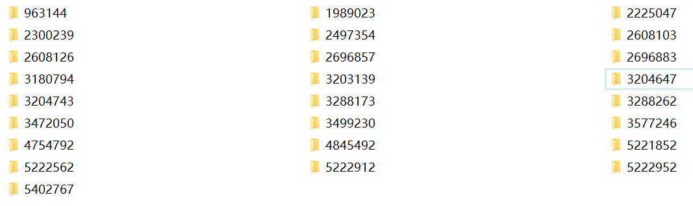
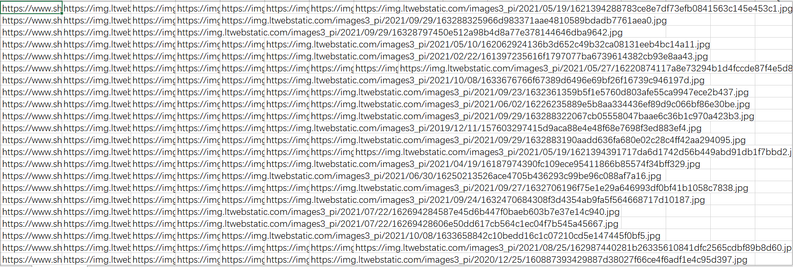

##说明
采用scrapy架构，爬取SHEIN的时尚女装。
> 声明：仅供python爬虫技术学习参考使用。

## 我的环境
```/yaml
Python 3.6.2
pywin32 300
Twisted 20.3.0
wheel 0.37.0
Scrapy 2.5.1
```

##安装
+ Linux:  
```/bin/bash
pip install scrapy
````

+ Window: 
```/bin/bash
下载地址：http://www.lfd.uci.edu/~gohlke/pythonlibs/#twisted   
pip install pywin32
pip install twisted
pip install wheel
pip install scrapy
```  

 ##运行
 ```/bin/bash
# cmd命令行运行
scrapy crawl chouti --nolog
# 或者 pycharm运行
python entrypoint.py
```

##运行结果
根据产品id生成目录并下载产品详情页的图片。

写入文件，第一列是详情页，后面是详情页中的图片地址。

